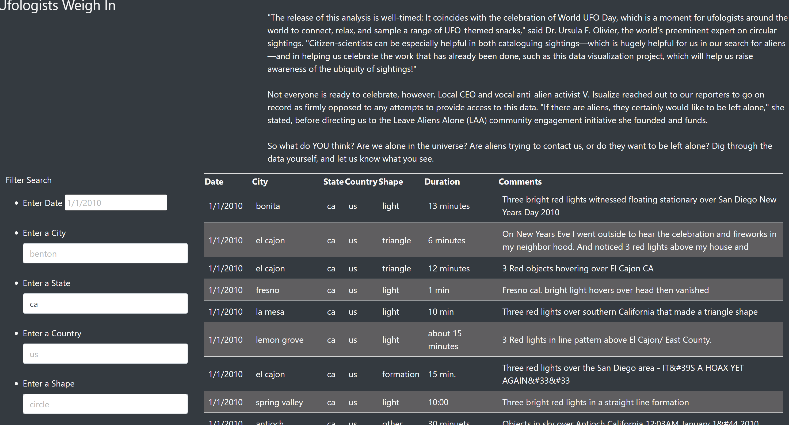
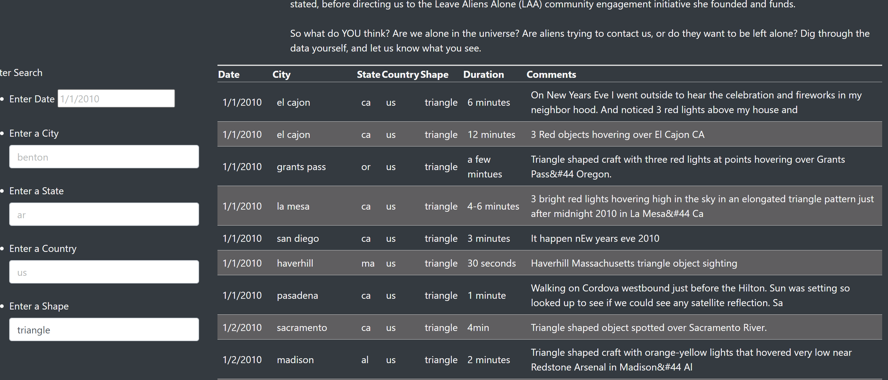

# UFO 

Main purpose this webpage is to search the UFO information by users.
Dana likes to provide a more in-depth analysis of UFO sightings by allowing users to filter for multiple criteria at the same time. The filter is based on state, city, and country.  In teh end people can search any UFPO information based on city, state, country, and shape.

# Results
 People use search filter functions and  enter any of these four input categories inckluding city, date, state and country and shaper as well. For example, user wants to know the UFO in california regardless of cities. The she or he chooses the state filter section and enters "ca" then next table will change in which she or he can see all UFO information in the California.
 
 if we want to search by shape s of UFO regardless of all inofrmation. we will get this.
 

 We also use multiple criteria for searching. If the data match in the database, we will get the data. if not, table will be empty. There is no information in the table. 
 
 # Summary 
if we search some multiple information or use case insensitive letters ( such as upper cases) we could not get any information. Therefore, we don't know our search is wrong or no such piece of data in the database. Another  searching is case sensitive in this projects. However, people can use upper case or lower case or short version or full name. In that case  becasue of case sensitiveity will create the search failed. Second, the data is not felxible which means we can't get recent infor. The data is only related 2010 certain time and beyond this time we can';t get more information.

